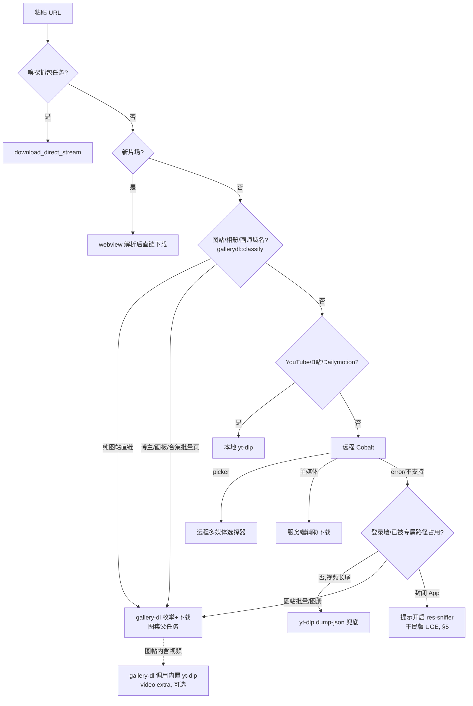

# 下载引擎路线图与 gallery-dl 集成实施计划

> **状态：** 计划评审稿（本文只做规划，暂不改功能代码）
> **日期：** 2026-10-09
> **适用代码基线：** v1.0.10（`8710b6c feat: yt-dlp 通用兜底`）
> **决策范围：** Cobalt 上游同步、gallery-dl 图集引擎、Streamlink 直播取舍、res-sniffer 平民版 UGE

**Goal:** 明确 Cobalt Desktop 多下载引擎的分工与演进顺序，并把"第二个 sidecar 引擎 gallery-dl"拆成可执行、可验证的任务；同时记录 Streamlink 暂不做、UGE 易用性后续做的决策依据，避免以后重复论证。

**Architecture:** 维持现有"远程 Cobalt 服务 + 本地 sidecar 引擎（yt-dlp / FFmpeg / res-sniffer）"的混合架构不变，新增一个**可重定位的 Python 运行时 + gallery-dl** 作为图站/相册/画师站引擎；Rust 侧按 URL 域名与帖子形态在 `run_download_task` 分流，图站走 gallery-dl，视频站走 yt-dlp，多媒体单帖仍优先远程 Cobalt 的 picker。直播（Streamlink）不进入当前有限文件下载队列。

**Tech Stack:** Tauri v2 / Rust（Tokio + Command）、Svelte 5、[astral-sh/python-build-standalone](https://github.com/astral-sh/python-build-standalone)（可重定位 CPython）、[mikf/gallery-dl](https://github.com/mikf/gallery-dl)（GPL-2.0）、现有 yt-dlp / FFmpeg / Go res-sniffer。

---

## 0. 结论速览（Decision Summary）

| 引擎 | 角色 | 覆盖规模（已核实，见 §8） | 许可证 | 现状 | 本次动作 |
|---|---|---|---|---|---|
| **yt-dlp** | 视频/点播主力 + 通用兜底 | 1700+ extractor（官方口径） | Unlicense（公共贡献） | **已交付**（本地优先 + 远程失败兜底） | 维持，不改动 |
| **Cobalt API**（imputnet/cobalt） | 远程服务的"官方题库"，多媒体帖子细粒度 picker | 上游 `main` 共 **21** 个 service 模块 | AGPL-3.0 | `api/` 为 vendored 快照，`@imput/cobalt-api@11.7.1`，**无上游 git 跟踪** | 建立**季度同步机制**（§2） |
| **gallery-dl** | 图站 / 相册 / 画师 / 漫画 | 官方支持表 **389** 个站点、**270** 个 extractor 模块 | GPL-2.0-only | 无 | **下一个 sidecar**，本计划主体（§3） |
| **Streamlink** | 直播流 | `master` **135** 个插件 | BSD-2-Clause | 无 | **暂不做**，决策记录（§4） |
| **res-sniffer**（Downie UGE 同源思路） | 未知站 / 封闭 App 抓包 | 自研，参考 res-downloader（Apache-2.0） | 见 `THIRD_PARTY_NOTICES.md` | 已有 MITM 嗅探器 | 后续做"一键 UGE"易用性（§5） |

### 对原始评审数字的校正（均以官方来源为准）

- gallery-dl 不是"2000+ 站"：官方 `docs/supportedsites.md` 自动生成表为 **389 个站点行 / 270 个 extractor 模块**（一个 extractor 常覆盖多个域名变体，但官方口径是 389）。仍然显著强于 yt-dlp / Cobalt 的图站能力，结论不变。
- gallery-dl **没有官方 macOS 单文件二进制**：官方仅提供 **Windows** `.exe`（Codeberg release，还依赖 VC++ x86 运行库）。因此"加一段下载逻辑、+10MB"不成立，macOS 必须自带 Python 运行时，体积增量以**数千万字节**计（实测为准，§3 Task 0）。
- Streamlink 插件数取整为"约 135~140"，`master` 实测 135 个插件文件。
- Cobalt 上游服务数为 21（`api/src/processing/services/*.js`），与第三方测评常说的"21 platforms"一致。

---

## 1. 现状分流管线（基于代码，作为改造锚点）

入口 `run_download_task()`（`src-tauri/src/lib.rs:1230`）当前顺序：

1. **嗅探抓包任务**：`captured_downloads` 命中 → `download_direct_stream()`（`lib.rs:1245`）。
2. **新片场**：`xinpianchang::is_xinpianchang_url()` → 隐藏 webview 解析 → 直链下载（`lib.rs:1255`）。
3. **本地 yt-dlp 优先站**：`is_local_ytdlp_url()` = YouTube / Bilibili / Dailymotion（`lib.rs:180`）→ `try_local_ytdlp_download()`（`lib.rs:1300`）。
4. **远程 Cobalt 服务**：`request_media_service_with_fallbacks()`（`lib.rs:1122`）。
   - `status == "error"`（不支持）且 `!is_ytdlp_probe_blocked(url)` → `probe_ytdlp_url()`（`--dump-json`）探测，能解析就本地 yt-dlp 兜底（`lib.rs:1378-1448`）。
   - `status == "picker"` → 远程轮播/多媒休帖子选择器（`lib.rs:1450`）。
   - 其余 redirect/stream/tunnel → 服务端辅助下载。
5. 登录墙 / App-only 站点（抖音、TikTok、快手、小红书、微博、IG/X/Pinterest 等）在 `is_ytdlp_probe_blocked()`（`lib.rs:187`）里被显式跳过，避免空等。

运行时资源通过 `resolve_ytdlp_path / resolve_node_path / resolve_ffmpeg_path()`（`lib.rs:574`）按"Tauri Resource → 开发目录 → Homebrew/系统"顺序解析；二进制由 `scripts/prepare-release-bundle.mjs` 在打包前放入 `src-tauri/binaries/`（gitignore），并在 `src-tauri/tauri.conf.json` 的 `bundle.resources` 声明。

### 目标分流（新增 gallery-dl 分支）



**优先级总原则**：单条多媒体帖子（IG/X/Pinterest/Reddit/TikTok/Tumblr）继续让远程 Cobalt 的 picker 优先（选第几张体验最好）；**博主主页、画板、合集、相册、漫画章节等"批量图片集合"**以及 Cobalt/yt-dlp 都不擅长的纯图站，走 gallery-dl。gallery-dl 只按**域名 + URL 形态**分流，不做盲探测（它没有 streamlink 那种 `--can-handle-url` 能力，盲跑会挂起）。

---

## 2. Cobalt 上游季度同步（评审项 #2）

### 现状

- `api/` 是直接拷进仓库的快照（`@imput/cobalt-api@11.7.1`，AGPL-3.0），**没有**配置 `imputnet/cobalt` 的 upstream remote，也没有记录对应上游 commit；`src-tauri/bundled-api/` 是另一份拷贝（已被 gitignore，且当前 `tauri.conf.json` 不再把它打进包，属于历史遗留，本次只登记、不删除）。
- 桌面端实际主要连远程实例（见 `docs/plans/2026-09-08-cobalt-api-server-migration.md`，`/opt/cobalt-api`），同步上游的直接收益是**远程实例白嫖新站与修复**，其次是保持仓库快照可追溯。
- 上游边界：**不做直播、不做图站/相册批量**，这是其设计边界，不会通过同步上游解决（正是 gallery-dl / Streamlink 要补的位）。

### Task 2.1：一次性建立上游跟踪基线（独立小改动，约 0.5 天）

**Files:**
- Create: `api/UPSTREAM.md`
- Modify: `.git/config`（本地 remote，不入库）

1. 加 upstream 只读远端并拉取：
   ```bash
   git remote add upstream https://github.com/imputnet/cobalt.git
   git fetch upstream --tags
   ```
2. 确定当前快照基线：在 `upstream` 中找到 `api/package.json` version 为 `11.7.1` 的 tag/commit（预期是 `v11.7.1` 附近），记入 `api/UPSTREAM.md`：
   ```
   Upstream: https://github.com/imputnet/cobalt
   Subdir:   api/   （本仓库 api/ 对应上游 monorepo 的 api/ 子目录）
   Pinned:   tag=v11.7.1  commit=<40位SHA>  记录日期=2026-10-09
   License:  AGPL-3.0（见 api/LICENSE）
   ```
3. 盘点本地相对上游的改动（这是以后每次合并的冲突清单）：
   ```bash
   rm -rf /tmp/upstream-api && mkdir -p /tmp/upstream-api
   git archive <pinned-sha> api | tar -x -C /tmp/upstream-api
   diff -qr /tmp/upstream-api/api api \
     | grep -v node_modules | grep -v .DS_Store
   ```
   已知本地多余文件至少包括：`api/scratch_test_yt.js`、`api/test_request.js`、`api/.DS_Store`、`api/src-tauri/`。把"本地保留项 / 本地补丁项"清单也写进 `api/UPSTREAM.md`；`scratch_test_*`、`.DS_Store` 这类应在首次同步时清理（单独提交，不混入合并）。

### Task 2.2：季度合并 Runbook（建议每季度首周，1/4/7/10 月）

新增 `scripts/sync-cobalt-api.mjs`（或先以 Runbook 手工执行，稳定后再脚本化），步骤：

1. `git fetch upstream`，读取 `api/UPSTREAM.md` 的旧 pin `$OLD`，选定目标 `$NEW=upstream/main`（或最新 release tag，**推荐跟 release tag 而非 main**，降低波动）。
2. 生成子目录补丁并三方应用：
   ```bash
   git diff "$OLD" "$NEW" -- api/ > /tmp/cobalt-api.patch
   git apply -3 /tmp/cobalt-api.patch        # 在仓库根执行，路径前缀已是 api/
   ```
   冲突只可能出现在 Task 2.1 盘点的本地补丁处；本地独有文件不受影响。
3. 安装与单测：
   ```bash
   pnpm --dir api install
   pnpm --dir api test:unit --run
   ```
4. 更新 `api/UPSTREAM.md` 的 pin（tag/commit/日期/本次变更摘要）。
5. 部署远程：按 `2026-09-08-cobalt-api-server-migration.md` 的隔离方式更新 `/opt/cobalt-api`（独立 systemd 单元、不碰其它服务），冒烟 `GET https://<实例>/` 的 `services` 列表与一次真实解析。
6. 提交（只提交 `api/` 与 `api/UPSTREAM.md` 相关变更），走正常发版或单独 PR；**AGPL-3.0 合规**：我们对外提供网络服务且仓库已开源，沿用现有开源披露即可，确认 `api/LICENSE` 与版本信息未被覆盖。
7. 若确认 `src-tauri/bundled-api/` 已彻底无用，另开一个清理任务，不在同步提交里顺手删。

> 不建议现在就把 `api/` 改造成 `git subtree`：当前前缀里有多处本地杂物，首次 subtree 合并冲突成本高；先用"pin SHA + 子目录补丁"跑顺 1~2 个季度，本地补丁稳定收敛后再评估 subtree。

### 落地结果（2026-10-09，Task 2.1 + 2.2 已完成）

- **基线已建立**：新增 `api/UPSTREAM.md`；本机配置只读远端 `upstream = git@github.com:imputnet/cobalt.git`（SSH，仅写本地 `.git/config`）。
- **Pin 结论**：上游**不为 api 11.x 打 tag**，且记录日 `upstream/main` 的 `api/package.json` 仍是 11.7.1，故按 commit pin 为 `a636575b09de1fc55d9b8cd98cac88f5f2f16b42`（2026-04-06，main tip）；用「对触及 `api/` 的提交逐一 numstat 树比对取最小差异」确定，差异分随历史单调上升。
- **本地漂移盘点**（详见 `api/UPSTREAM.md` §3）：本地新增 12 个文件（为脱离 monorepo 而提交的 `version-info/` 构建产物、自加的 vitest 单测体系 5 个测试 + `vitest.config.ts`、子路径感知的 `misc/api-url.js`、2 个孤立调试脚本）；**0 个**上游文件被删；约 20 个上游文件被改（核心是远程「YouTube 走服务端 yt-dlp 隧道」`/yt-dlp`、tunnel/流式健壮性、B 站/Pinterest/X/YouTube 提取器增强）；另有 **89 个**纯 `644→755` 模式位噪声（内容 sha 一致）。已入库待清理杂物：`api/scratch_test_yt.js`、`api/test_request.js`（未跟踪的 `.DS_Store`/`node_modules`/`api/src-tauri` 残留均已被现有 ignore 覆盖）。
- **同步脚本已交付**：`scripts/sync-cobalt-api.mjs`，默认 dry-run；支持 `--apply/--to <ref>/--no-fetch/--install/--no-test/--force`；自动 fetch、解析旧 pin、统计 `OLD→NEW` 子目录变更、**预判与本地补丁重叠的冲突文件**、`git apply -3` 三方应用、AGPL/LICENSE 与 `version-info`/vitest 依赖守卫、跑 api 单测；不自动提交、不自动改 pin 文档（打印待粘贴内容）。已在临时 git worktree 端到端验证：干净文件自动合并、在预判重叠文件（`package.json`/`youtube.js`）真实产生冲突并安全中止。
- **遗留到首次真实同步**：按 `api/UPSTREAM.md` §5 的命令**单独提交**删除调试脚本 + 统一模式位（勿混入合并提交）；首次合并后恢复 `package.json` 的 `file:./version-info` + vitest、无 `isolated-vm`。本次改动**未 git commit**。

---

## 3. gallery-dl 集成实施计划（评审项 #3，推荐第二个落地的引擎）

### 3.1 选型与关键事实

- 仓库：[mikf/gallery-dl](https://github.com/mikf/gallery-dl)，**GPL-2.0-only**，纯 Python，要求 **Python ≥ 3.8**（PyPI 最新 1.32.x）。
- 能力：图片集 / 漫画 / 画师主页 / 相册（Pixiv、ArtStation、DeviantArt、微博相册、booru 系、danbooru、gelbooru、yande.re、imgur 相册、Flickr、Tumblr 博客、Reddit、Pinterest 画板等），正中 yt-dlp 与 Cobalt 的图站短板。
- 官方**无 macOS/Linux 单文件**，只有 Windows `.exe`。经确认采用**捆绑可重定位 Python 运行时**（本计划），不下载任何第三方 macOS 二进制（供应链不可控）。
- 关键 CLI（参数以源码 `gallery_dl/option.py` 为准）：
  - `-j / --dump-json`：枚举媒体项（**不下载**），用于得到总数。**实测 1.32.16 输出是一个整体美化打印（缩进 2 空格）的顶层 JSON 数组**，元素为消息数组：元数据行 `[2,{...}]`、URL 行 `[3,"<resolved_url>",{...}]`；张数 = 顶层数组里首元素为 `3` 的个数（`count_dump_items()` 先按整份 JSON 文档解析，失败再回退逐行 NDJSON）。`-J` 会进一步解析中转 URL。
  - `-d <dir>` 下载时，每个完成文件的**绝对路径打印到 stdout**（在 `<dir>/<category>/...` 下，保留 gallery-dl 默认分类子目录）；进度条/日志走 stderr。执行器据此逐行 `starts_with(folder)` 累加 `items_done`。
  - `-d / --destination <dir>`、`-D / --directory <base>`、`-f / --filename <fmt>`：输出位置与命名。
  - `-g / --get-urls`：只打印 URL。
  - `--proxy <url>`、`-C/--cookies <file>`、`--cookies-from-browser BROWSER[:PROFILE]`（与 yt-dlp 同源，可复用 Chrome cookie 逻辑）。
  - `-c/--config <json>`：可下发配置，包括把图帖里的视频项委托给 yt-dlp（`video` extra / ytdl 集成，可选）。
- 与现有 yt-dlp 的协同：gallery-dl 遇到图站里的视频（如 Pixiv 视频、X 视频）可配置调用内置 yt-dlp，两个引擎不是互斥关系。

### 3.2 Task 0：打包 Spike（**最高优先，先证伪再写功能**，约 1~2 天）

这是整个计划的最大风险点，必须先打通，**不通过就换方案**。

**背景（已有前车之鉴）：** `scripts/post-build-bundle.mjs` 现有注释明确写到——yt-dlp 是 PyInstaller 单文件、内嵌 Python 框架，**ad-hoc 重签后内嵌框架无法加载**，CI 只能"验存在、不执行"。我们新捆绑的 CPython 运行时含大量 Mach-O（`python3.12`、`libpython`、各 `.so`），极可能踩同一个签名/库校验坑。

**要验证的事：**

1. 下载 [python-build-standalone](https://github.com/astral-sh/python-build-standalone) 的 `cpython-<ver>-aarch64-apple-darwin-install_only.tar.gz`（**校验官方 `.sha256`**），解压到 `src-tauri/binaries/python/`。
2. **不用 venv**（venv 写入绝对路径、不可重定位）。改用 target 目录安装：
   ```bash
   PY=src-tauri/binaries/python/bin/python3
   "$PY" -I -m pip install --no-compile --target src-tauri/binaries/python-packages \
     "gallery-dl[video]==<pin>"
   ```
3. 精简：删除 `tkinter、test、ensurepip、idlelib、turtledemo、include、share/man、__pycache__` 等，记录精简前后体积。
4. 以**打包后的真实环境**调用（模拟 Rust 的环境变量）：
   ```bash
   PYTHONHOME=<res>/binaries/python \
   PYTHONPATH=<res>/binaries/python-packages \
   <res>/binaries/python/bin/python3 -I -s -m gallery_dl --version
   ```
5. 跑一次 `tauri build --bundles app` + `post-build-bundle.mjs`（ad-hoc），在 `.app` 包内、以及一台**干净的、未装 Python 的 Mac** 上右键打开后，让应用真实 spawn 上述命令对一个公开 URL（如 `https://danbooru.donmai.us/posts?tags=...` 或 gelbooru 公开图）跑 `-j` 枚举，确认：
   - ad-hoc 签名后 CPython 与 `.so` 能正常加载（对照 yt-dlp 的坑）；
   - 不依赖系统 Python、不依赖终端环境变量；
   - 记录 **DMG / .app 的实际体积增量**（目标：精简后运行时目录 ≤ ~50MB、DMG 压缩增量 ≤ ~25MB；超标需进一步裁剪或换方案）。

**判定：**

- ✅ 通过 → 按 Task 1~9 继续。
- ❌ ad-hoc 重签后 CPython 无法运行且无法用 `disable-library-validation` 解决 → 改用**备选方案：在 macOS runner 上自己用 PyInstaller 把 gallery-dl 打成单文件 arm64 二进制**（构建源仍是官方 gallery-dl，无第三方信任问题，产物形态与签名流程完全复用现有 yt-dlp 经验），体积约 20~30MB。此备选仍属"捆绑 Python"，但把风险收敛成一个已被 yt-dlp 验证过的单文件。

#### 3.2.1 Task 0 实测结果（2026-10-09，✅ 门禁通过，无需 PyInstaller 备选）

**结论：** python-build-standalone 方案在 ad-hoc 重签后的 `.app` 内真实可运行，按 Task 1~9 继续。下列结论以钉版实测为准，**取代上文中的示例命令**。

**钉版（脚本默认值 + 两个 workflow env 已同步）：** `PYTHON_BUILD_TAG=20261003`、`PYTHON_VERSION=3.12.15`、`GALLERY_DL_VERSION=1.32.16`；资产 `cpython-3.12.15+20261003-aarch64-apple-darwin-install_only_stripped.tar.gz`，用 release 目录下单一 `SHA256SUMS` 校验（逐资产 `.sha256` 是 404）。

**对原方案的两处关键修正：**

1. **不建独立 `python-packages/`，也不传 PYTHONHOME/PYTHONPATH。** gallery-dl 直接装进运行时自带的 `lib/python3.12/site-packages`（`pip -I -m pip install --no-compile --target <prefix>/lib/python3.12/site-packages gallery-dl==<ver>`）。该发行版**可按可执行文件相对路径自定位 stdlib**，最终调用固定为：
   ```bash
   <res>/binaries/python/bin/python3.12 -I -m gallery_dl ...
   ```
   `-I`（isolated）自动忽略 PYTHONPATH/PYTHONHOME/user-site，实测伪造 `PYTHONHOME=/nonexistent PYTHONPATH=/nonexistent` 仍正常；Rust 侧无需也**不应**设置任何 PYTHON* 变量（并应显式清除环境里的 PYTHON*，只用绝对路径）。
2. **`install_only_stripped` 是静态解释器**：`bin/python3.12`(约 18M) 不依赖 `libpython3.12.dylib`，`_ssl/_hashlib/_socket/zlib/_lzma/_sqlite3` 全部内建；`lib-dynload` 仅 `_crypt/_dbm`，另加 pip 带入的 `charset_normalizer` 的 `cd/md` 两个 `.so`。因此可删除 17M 的 dylib 与整套 Tcl/Tk。精简后运行时 **71M → 34M**（删除清单已固化在 `ensurePythonGallerydl()`，含 tkinter/test/ensurepip/idlelib/include/share/man、pip、Tcl/Tk、bin 辅助脚本与全部 `__pycache__/*.pyc`；字节码在冒烟后再清一次，冷启动仅差约 0.15s）。

**Tauri 资源打包踩坑（重要）：** `bundle.resources` 的 map 写法里，**带 `*` 的 glob 会被压平**——`"binaries/python/**/*": "binaries/python/"` 会把整棵树（bin/lib/site-packages、.so）全部平铺进 `python/` 一层而毁掉结构（tauri-utils 2.9.2 `resources.rs` 对 Glob 目标执行 `dest.join(file_name())`）。正确写法是**映射目录本身**（触发 Walk 并保留相对路径）：
```json
"binaries/python": "binaries/python"
```

**签名：** 新增 `src-tauri/entitlements/python.plist`（`com.apple.security.cs.disable-library-validation`，与 yt-dlp 同）。`post-build-bundle.mjs` 先签 `binaries/python` 下所有 `*.so/*.dylib`（含 `charset_normalizer` 的两个），再用该 entitlement 签解释器，最后签外层 `.app`；ad-hoc 模式不带 entitlement（逻辑同 yt-dlp）。`codesign --verify --deep --strict` 通过。

**门禁证据（均在重签后的 `.app` 内、`env -i PATH=/usr/bin:/bin` 清空环境下执行，模拟无系统 Python 的干净机）：**

| # | 检查 | 结果 |
|---|---|---|
| 1 | `python3.12 -I -m gallery_dl --version` | `1.32.16` |
| 2 | 伪造 PYTHONHOME/PYTHONPATH | 被忽略，仍 `1.32.16` |
| 3 | `import _ssl,_hashlib,_socket,charset_normalizer.md,certifi,gallery_dl` | OK，OpenSSL 3.5.9 |
| 4 | bundled `requests` 真实 HTTPS（certifi 校验） | 200 |
| 5 | `gallery-dl -j` 直链枚举 | 输出 directlink 结构化 JSON |
| 6 | `gallery-dl -d` 真实下载 | 落盘成功，PNG 签名正确 |

另：挂载**新构建 DMG 内嵌的 Tauri 原生 ad-hoc app**（release 流程中 post-build 在 DMG 生成之后才跑，故 DMG 走的是 Tauri 签名而非 post-build 重签）同样通过 #1/#3。本地用 `env -i` 作为干净机代理；CI 的全新 macOS runner 即真正的干净机，需在首次发版时复核一次。

**体积（实测）：** 运行时目录 34M（预算 ≤~50M ✅）；DMG 99.4 MiB → 111.3 MiB，**增量 11.8MB**（预算 ≤~25MB ✅；gzip 交叉验证约 10.7MB）。基线 v1.0.10 DMG=104,255,987B，新 DMG=116,656,279B。

**改动文件：** `scripts/prepare-release-bundle.mjs`（新增 `ensurePythonGallerydl()`）、`scripts/post-build-bundle.mjs`（Python 树签名）、`src-tauri/tauri.conf.json`（目录资源映射）、`src-tauri/entitlements/python.plist`（新建）、`.github/workflows/{ci,release}.yml`（版本 env）、`THIRD_PARTY_NOTICES.md`（GPL-2.0/PSF/OpenSSL 等声明）。

### 3.3 Task 1：域名分流与优先级（纯函数 + 单测先行）

**Files:**
- Create: `src-tauri/src/gallerydl.rs`
- Modify: `src-tauri/src/lib.rs`（注册模块、在 `run_download_task` 插入分流、调整 `is_ytdlp_probe_blocked`）
- Modify: `src-tauri/Cargo.toml`（一般无需新依赖）

1. 在 `gallerydl.rs` 实现并单测：
   - `enum GalleryRoute { None, Direct, BulkCollection }`
   - `classify(url: &str) -> GalleryRoute`：基于 host 后缀表 + URL 形态（路径里出现 `/user/`、`/board/`、`/artworks`、`/gallery/`、`/album/`、画师 id、漫画章节等判定为 `BulkCollection`）。
   - 域名种子表从官方 389 站点表中挑高价值项落地，首批建议：Pixiv、ArtStation、DeviantArt、danbooru/gelbooru/safebooru/yande.re/konachan/zerochan 等 booru 系、imgur 相册、Flickr、微博相册（`weibo.com` 图帖）、Nijie、Niconico静画/Seiga；Tumblr 博客、Reddit 用户/子版、Pinterest 画板、IG 主页、X 媒体只在**批量形态**命中。
2. 定义**优先级矩阵**（写进模块文档注释 + 测试）：
   | URL 类型 | 首选 | 次选 |
   |---|---|---|
   | YouTube/B站/Dailymotion | yt-dlp（不变） | — |
   | 纯图站直链/图册/画师主页/漫画 | **gallery-dl** | 失败再提示嗅探 |
   | IG/X/Pinterest/Reddit/TikTok/Tumblr **单帖** | 远程 Cobalt picker（不变） | Cobalt 报错 → gallery-dl（批量/整楼）→ yt-dlp |
   | 同上 **主页/画板/合集/频道** | **gallery-dl** | — |
   | 微博**图帖/相册** | **gallery-dl**（带浏览器 cookie） | 视频维持现有阻断/嗅探 |
   | 未知域名 | 远程 → yt-dlp 兜底（不变） | **不**盲跑 gallery-dl |
3. 在 `run_download_task` 的"新片场之后、本地 yt-dlp 之前/并列"插入 gallery-dl 直连分支；在远程 `error` 兜底段，把"图站批量"补到 yt-dlp 探测之前。
4. 更新 `is_ytdlp_probe_blocked()`：已明确归 gallery-dl 的纯图站域名加入阻断，避免两个引擎重复尝试；补全 `lib.rs` 末尾现有 `generic_probe_blocklist_*` 风格的单测用例（正反例都要，参照 `lib.rs:2202` 的测试写法）。

### 3.4 Task 2：prepare 脚本落地可重定位 Python + gallery-dl

**Files:**
- Modify: `scripts/prepare-release-bundle.mjs`
- Modify: `.github/workflows/ci.yml`、`.github/workflows/release.yml`（版本 env）

1. 仿照现有 `ensureYtDlp()`（`prepare-release-bundle.mjs:62`）新增 `ensurePythonGallerydl()`：
   - 版本用环境变量钉死，命名与 `YT_DLP_VERSION` 对齐：`PYTHON_BUILD_TAG`（python-build-standalone 完整 tag，含日期）、`GALLERY_DL_VERSION`。
   - 已存在则跳过（本地可缓存）；不存在则下载 → **校验 SHA256** → 解压 → `pip install --target` → 精简 → `chmod 0755`。
   - 冒烟：`python -I -s -m gallery_dl --version` 必须输出版本（此步发生在重签之前，可直接执行）。
2. 两个 workflow 的 `env:` 与 `YT_DLP_VERSION` 并列加上述版本常量；**保持 `Prepare bundled runtimes` 在 `cargo check` 之前的既有顺序**（AGENTS.md 明令禁止调换）。
3. 网络依赖与 yt-dlp 下载同级（CI 本来就有外网）；不支持完全离线构建，与现状一致，写进 release 说明。

### 3.5 Task 3：Tauri 资源声明与 macOS 签名

**Files:**
- Modify: `src-tauri/tauri.conf.json`
- Modify: `scripts/post-build-bundle.mjs`
- Create（如需）: `src-tauri/entitlements/python.plist`

1. `bundle.resources` 增加 Python 目录与 `python-packages` 目录。Tauri v2 资源支持目录/glob，先按 `"binaries/python/**/*": "binaries/python/"` 形式验证 schema；若不递归，改为在 `beforeBuildCommand` 里枚举文件生成显式映射。
2. `post-build-bundle.mjs` 现在只签 `ffmpeg / res-sniffer / yt-dlp` 三个单文件。新增：
   - 遍历 `Contents/Resources/binaries/python`，对所有 Mach-O（`python3.12`、`libpython*.dylib`、`.so`）逐个 `codesign --force --sign`；
   - 给 `python3.12` 可执行文件套用与 yt-dlp 相同的 `com.apple.security.cs.disable-library-validation` 授权（复制 `entitlements/yt-dlp.plist` 为 `python.plist`），使其能加载同目录第三方签名的 `.so`；
   - **最后**再签外层 `.app` 并 `codesign --verify --deep --strict`（顺序不能反）。
3. ad-hoc（CI）与 Developer ID（本地）两条路径都要验证；公证（notarization）当前整体未做，本任务不新增公证，但要确认 Task 0 的干净机 ad-hoc 实测通过。

### 3.6 Task 4：Rust 执行器（枚举 / 下载 / cookie / 代理 / 取消）

**Files:**
- Create: `src-tauri/src/gallerydl.rs`（执行器部分）
- Modify: `src-tauri/src/lib.rs`（`resolve_*` 新增 Python 解析、任务执行分支）

1. 新增 `resolve_python_home / resolve_python_packages / resolve_python_bin()`，沿用 `resolve_ytdlp_path()` 的"Resource → 开发目录 → 系统"绝对路径白名单思路（**禁止裸 `python3` 走 PATH**，防止命令劫持）。
2. `Command::new(python_bin)`，固定参数 `-I -s -m gallery_dl`，设置 `PYTHONHOME / PYTHONPATH`（清空继承的同名变量），`--proxy` 透传 `settings.proxy_url`（与 yt-dlp 一样，代理失败显式报错不静默直连）。
3. 登录态图站（Pixiv / 微博等）复用 `chrome_cookie_sources()`（`lib.rs:613`）传 `--cookies-from-browser chrome:<profile>`；安全等级对齐 yt-dlp（绝对路径、不把 cookie 泄给前端）。
4. **两阶段执行**：
   - 枚举：`-j <url>` 收集 JSON 行 → 得到 `items_total`、建议目录名/标题；枚举失败则退化为不确定进度。
   - 下载：`-d <下载目录>/<安全目录名> -f <命名模板> <url>`；逐行解析 stdout（每完成一个文件打印目标路径，**具体格式在 Task 0 用钉版版本确认**，不要凭记忆解析），推进 `items_done`。
5. 取消：复用现有 `cancellations: oneshot` 机制，取消时 kill 子进程（gallery-dl 收到 SIGTERM 会退出）；保留已下载的部分文件，失败信息提示"已保留 N/总数"。
6. 视频项委托（可选，v1.1）：通过临时 `--config` 指向内置 yt-dlp 路径并开启 ytdl 集成，让图帖视频也能下；v1 先允许"图片成功、视频项报错提示"。

### 3.7 Task 5：图集任务模型（一个父任务，聚合进度）

**Files:**
- Modify: `src-tauri/src/lib.rs`（`DownloadTask` 结构、持久化、完成态）

1. `DownloadTask`（`lib.rs:65`）向后兼容地增加可选字段：`kind: "file"|"gallery"`（缺省 file）、`engine: String`、`items_total: u32`、`items_done: u32`。
2. **一个粘贴 URL = 一个父任务**，不把每张图拆成队列任务（否则会冲爆并发槽、污染调度器）；gallery-dl 内部顺序/自带限速下载，父任务占用一个并发槽。
3. 状态流：`queued → analyzing(枚举中) → downloading(x/N) → completed/failed/cancelled`；`progress = items_done/items_total`；`total_bytes` 对图集允许为 0（不显示总字节，改显示张数）；`output_path` 指向**图集文件夹**，"在 Finder 中显示"打开目录。
4. 持久化沿用 `save_tasks()` 原子写；重启后图集任务不尝试断点续传子项（v1 只记录最终状态），已存在文件靠 gallery-dl 默认跳过逻辑去重。
5. 目录命名走现有 `unique_output_path()` 同款安全清洗，避免路径穿越与非法字符。

### 3.8 Task 6：前端 UI 与多语言

**Files:**
- Modify: `src/routes/+page.svelte`（任务卡）
- Modify: `src/lib/i18n/{zh,en,ru}.json`
- 如需：`src/lib/services.ts`

1. 图集任务卡副标题显示聚合进度：`{items_done}/{items_total} 张图片`（en: `{items_done}/{items_total} images`，ru 对应复数），引擎徽标显示 `gallery-dl`；音频模式下图集请求按视频/图片默认处理（图站无音频模式概念，直接忽略音频开关或灰置提示）。
2. 失败且域名为封闭 App / 未知站时，任务卡给出"开启资源嗅探"按钮（承接 §5 Phase 1）。
3. 三种语言都要补齐，`pnpm check` 必须过。

### 3.9 Task 7：许可证与第三方声明

**Files:**
- Modify: `THIRD_PARTY_NOTICES.md`
- Create: `third_party/gallery-dl/LICENSE`、`third_party/python-build-standalone/LICENSE`（或在打包时从产物拷贝 license 目录）

1. gallery-dl 为 **GPL-2.0-only**：以独立子进程方式调用通常属于"聚合"而非衍生，但必须随包附带 LICENSE、记录钉版版本与源码链接、保留源码获取途径；本计划不构成法律结论，发版前按此核对。
2. python-build-standalone / CPython 为 PSF License，内含 OpenSSL(Apache-2.0) 等组件，附带其 license 集合；gallery-dl 依赖 requests(Apache-2.0)、certifi(MPL-2.0)、urllib3/idna/charset-normalizer(MIT/BSD) 等，至少在声明里列出版权与许可。
3. 不修改 gallery-dl 源码；若以后打补丁，必须按 GPL 公开对应修改。

### 3.10 Task 8：CI / Release 与发版文档

**Files:**
- Modify: `.github/workflows/ci.yml`、`.github/workflows/release.yml`
- Modify: `AGENTS.md`、`RELEASE.md`（如涉及）

1. 两个 workflow 增加 Python/gallery-dl 版本 env；Release 产物清单预期新增体积，`INSTALL.md` 无需改逻辑。
2. `release:check` 可考虑加一条 gallery-dl 版本冒烟（在 prepare 之后）；**不得**把 `cargo check` 移到 prepare 之前（AGENTS.md 禁项 5）。
3. AGENTS.md 增补：新捆绑运行时（Python + gallery-dl）的版本升级方式、签名清单新增 Python 目录、体积监控；`sync-versions` 四文件发版流程不变。
4. 发版后按 AGENTS.md §3 用 `gh run list` 轮询，并在干净机验证 gallery-dl 真机下载（不只看 CI 绿灯）。

### 3.11 Task 9：真机验证矩阵（每种至少一个公开 fixture）

| 站点 | 形态 | 登录要求 | 期望 |
|---|---|---|---|
| gelbooru / danbooru | 标签搜索多图 | 公开（danbooru 部分内容分级） | 枚举数=下载数，目录完整 |
| Pixiv | 单个图集 + 画师主页 | 需浏览器 cookie | cookie 生效，批量落盘 |
| ArtStation / DeviantArt |  artwork / gallery | 公开为主 | 原图分辨率，非缩略图 |
| yande.re / konachan | 帖子/池 | 公开 | booru 元数据命名正确 |
| 微博 | 九宫格图帖 | 需 cookie | 图片全量，视频不误走 |
| imgur | `/a/` 相册 | 公开 | 整册下载 |
| IG/X 单帖 | 远程 picker | 现有路径 | **不回归**，仍走 Cobalt |
| YouTube/B站 | 视频 | 现有路径 | **不回归**，仍走 yt-dlp |
| 未知域名 | 任意 | — | 不被 gallery-dl 盲跑、不挂起 |

验收：`pnpm release:check` 全绿；干净 Apple Silicon 机 ad-hoc 包实测上表全过；任务卡进度、取消、在 Finder 打开目录均正确；DMG 体积增量在 Task 0 预算内并记录实际值。

### 3.12 落地状态（2026-10-09，Task 1 / 4 / 5 / 6 / 7 / 8 已完成；Task 9 公开站点已实测，余干净机/登录项）

**代码**
- `src-tauri/src/gallerydl.rs`：`GalleryRoute{None,Direct,BulkCollection}` + `classify()` 纯函数（两张 host 后缀表：单帖也接管的纯图站、仅批量形态接管的 IG/X/Pinterest/Reddit/Tumblr）、`is_gallery_capable_host()`（远程失败兜底用）、`count_dump_items()`（解析 `-j`，兼容整体美化 JSON 与 NDJSON）；自带 8 个 `#[cfg(test)]` 单测（单帖/合集/单帖留远程/主页接管/lookalike 与垃圾输入不盲跑/host 能力/两种 JSON 形状）。
- `src-tauri/src/lib.rs`：
  - `DownloadTask` 新增 `kind / engine / items_total / items_done`（均 `#[serde(default)]`，旧 tasks.json 向后兼容）。
  - `resolve_python_bin()`：只认 Resource `binaries/python/bin/python3.12` 与开发目录，**无系统 python 回退**。
  - `try_local_gallery_download()`：固定 `<python> -I -m gallery_dl`（**只用 `-I`，并 `env_remove` 掉 PYTHONHOME/PYTHONPATH/PYTHONSTARTUP**，取代上文曾设想的“设置 PYTHONHOME”）；代理走 `--proxy`（失败显式报错）；cookie 依次尝试 `None → chrome:Default → chrome:Profile N → safari → firefox`，枚举成功即锁定同一 cookie 再下载；枚举 180s 超时；复用 `oneshot` 取消（kill 并**保留**图集文件夹内部分文件）；完成后递归统计文件数/字节回填。
  - 分流：`run_download_task` 在新片场之后、本地 yt-dlp 之前对 `classify().owned()` 直连 gallery-dl；远程 `status=error` 时，对 `is_gallery_capable_host()` 的单帖先补 gallery-dl，再让 yt-dlp 兜底；`is_ytdlp_probe_blocked()` 对 gallery-dl 接管的 URL 一律阻断 yt-dlp 盲探（含正反例回归）。
  - 目录：`gallery_folder_name()` + `unique_gallery_dir()` 做安全清洗与去重，`output_path` 指向图集文件夹。
- 前端 `src/routes/+page.svelte`：图集卡副标题显示 `{done}/{total}` 张数（analyzing/downloading/completed 三态文案）、`gallery-dl` 徽标、进度条按张数推进（不再因 total_bytes=0 走 indeterminate）；失败图集给“开启资源嗅探”按钮（切到 sniffer 模式并 `start_sniffer`，平民版 UGE 入口）。`zh/en/ru` 三语已补齐；`pnpm check` 0 错。

**实测证据（开发目录捆绑运行时，`env -i PATH=/usr/bin:/bin` 清空环境，走 `--proxy`）**
- yande.re 单帖 `/post/show/1270201`：`-j` 整份 JSON 中 code-3 行 = **1**；`-d` 下载落盘 `yandere/yande.re_1270201_….jpg`（765,919B），stdout 打印的绝对路径位于目标文件夹内（执行器计数假设成立）。
- yande.re 标签搜索 `post?tags=hatsune_miku`（`--range 1-2` 限流）：code-3 行 = **2**（4 条消息 = 2 元数据 + 2 URL），批量枚举解析正确。
- `cargo test` 全绿（25 个测试，含 gallerydl 8 个与 blocklist 正反例）；`pnpm release:check` 全绿。

**Task 7（许可）已补齐（2026-10-09）**：核对发现 `install_only_stripped` CPython 产物**只带** `lib/python3.12/LICENSE.txt`，不含静态链接组件（OpenSSL/zlib/…）的许可文本，且原声明里 gallery-dl 的路径写错（实际在 `gallery_dl-<ver>.dist-info/licenses/LICENSE`）。已：
- 新增仓库内规范副本 `third_party/gallery-dl/`（GPL-2.0 `LICENSE` + `UPSTREAM.md`）与 `third_party/python-build-standalone/`（根 `LICENSE`=工具链 MPL-2.0、`licenses/LICENSE.*.txt` 共 19 份组件许可 + `python-licenses.rst`，均按 tag `20261003` 从上游仓库拉取，各附 `UPSTREAM.md`）。
- `prepare-release-bundle.mjs` 在运行时就绪后**无条件**把这些许可汇入 `binaries/python/licenses/`（`gallery-dl.GPL-2.0-only.txt`、`python-build-standalone.LICENSE.txt`、`components/` 20 份），随 Tauri 目录资源进包；已实跑 prepare 验证落位。
- 更正 `THIRD_PARTY_NOTICES.md`：gallery-dl 稳定路径、CPython/PSF、工具链实为 **MPL-2.0**（原误写 MIT）、组件许可位置、wheel 的 `*.dist-info/licenses/`。

**Task 8（CI/发版）核对通过**：两个 workflow 均有 `PYTHON_BUILD_TAG/PYTHON_VERSION/GALLERY_DL_VERSION` 三个 env，且 `prepare:release-bundle` 在 `cargo check --locked` **之前**（符合 AGENTS 禁项 5）；gallery-dl `--version`/import 冒烟已内置在 prepare（缓存命中也跑许可汇入）；`AGENTS.md` 增补了 Python/gallery-dl 版本升级与许可刷新步骤。

**Task 9 公开站点真机矩阵（开发目录捆绑运行时，`env -i PATH=/usr/bin:/bin` 仅给 PATH，走 `--proxy http://127.0.0.1:7897`，2026-10-09）**：

| 站点 | 形态 | 结果 |
|---|---|---|
| yande.re 单帖 `/post/show/1270201` | booru 单帖 | `-j` code-3=**1**；`-d` 实下 765,919B jpg（此前已测） |
| yande.re 标签搜索 `tags=hatsune_miku`（`--range 1-2`） | booru 批量 | code-3=**2**（此前已测） |
| **danbooru** 标签搜索 `posts?tags=cat`（`--range 1-3 / 1-2`） | booru 批量 | 枚举 code-3=**3**；`-d` 实下 **2** 张原图（1,564,734B / 980,581B），落 `danbooru/cat/`，枚举数=下载数 |
| **ArtStation** 画师页 `/wlop`（`--range 1-3 / 1-2`） | 画师主页批量 | 枚举 code-3=**3**；`-d` 实下 **2** 张原图（597,466B / 353,591B，非缩略图），落 `artstation/wlop/` |
| gelbooru 标签搜索 | booru 批量 | **`AuthRequired: 'api-key' & 'user-id' needed`**——gelbooru 现对标签搜索 API 强制免费账号 key（gallery-dl 干净报错、不挂起）；需在 gallery-dl config 配 key 后复测，单帖/其它 booru 已由 danbooru/yande.re 证明 |
| konachan（.com/.net） | booru 批量 | **Cloudflare 403 challenge**——代理出口 IP 被反爬拦截，非引擎问题；需在住宅网络/干净机复测 |
| imgur `/t/cat` | 标签流 | 代理下分页**超时挂起**（>120s）；`/a/<非法id>` 被正确判为 `Unsupported URL`（URL 校验生效）；需用**具体公开 `/a/<id>` 相册**在干净网络复测 |

- 分流回归：IG/X 单帖走 Cobalt、YouTube/B站走 yt-dlp、未知域名不盲跑，由 `cargo test` **25 个**单测锁定（全绿），本轮未改 Rust 分流；`pnpm release:check` 全绿（svelte-check 0/0、`cargo check --locked`、api **58** 测试）。
- 体积：Task 0 实测 DMG 增量约 **+11.8MB**（运行时目录精简后约 34MB），在预算内。

**Task 9 仍需在干净 Apple Silicon 机 + 真人环境收尾（开发机/代理无法替代）**：
1. 打 ad-hoc `.app`，在**未装 Python、住宅网络**的 Apple Silicon 机右键打开，跑通：Pixiv 单图集+画师主页、微博九宫格（两者需浏览器 cookie，验证 cookie 尝试链）、DeviantArt（常需 OAuth/登录）、imgur 具体 `/a/` 相册、gelbooru（配免费 api-key）、konachan（住宅网络绕开 Cloudflare）。
2. App 内人工确认：图集任务卡张数进度、取消（保留部分文件）、"在 Finder 中打开目录"、失败时"开启资源嗅探"按钮。
3. 人工再确认一次 IG/X 单帖仍走 Cobalt、YouTube/B站仍走 yt-dlp（单测已锁，真机复核）。

---

## 4. Streamlink：暂不做（评审项 #4，决策记录）

- 事实：[Streamlink](https://streamlink.github.io/) 为 **BSD-2-Clause**、纯 Python，`master` 实测 **135** 个插件，**主业直播、VOD 很弱**（官方 plugins 页明确 "primary focus is live streams, so VOD support is limited"），覆盖 Twitch / YouTube Live / 抖音直播 / 斗鱼 / 虎牙 / B 站直播等。
- **暂不做的根本原因——任务模型冲突**：现有下载队列是"有限文件"模型（有 total bytes、ETA、必然 completed）。直播是**无限流**：需要手动/定时停止、时长或体积上限、分段落盘、断线重连、时间戳命名、一个独立的"录制中"生命周期与磁盘守卫。硬塞进现有队列会产生永不结束、无 ETA、可能写满磁盘的任务，污染调度器与持久化模型。
- **更便宜的替代先评估**：yt-dlp 本身已能录制相当一部分直播（YouTube Live / Twitch / B 站直播等，支持直播相关参数）。在决定引入 Streamlink 前，若只是偶发直播需求，应先给 yt-dlp 路径加"最长时长 / 最大体积 / 手动停止"的录制能力，验证覆盖面。
- **再进入条件**：直播录制成为明确产品目标；且出现一批 yt-dlp 搞不定、Streamlink 插件明显更强的目标站（如 Twitch 广告/客户端完整性令牌场景）；并愿意为"录制"单独建任务模型。届时可复用本计划引入的 Python 运行时（Streamlink 也是 Python），通过 `--record`/`-O` 落文件或 `-r` ringbuffer，但必须配套：独立 task kind、手动停止、默认时长/体积上限、分段与磁盘守卫、独立 UI 入口。

---

## 5. 平民版 UGE：res-sniffer 易用性（评审项 #5，后续）

- Downie 的 UGE（User-Guided Extraction）= 应用内嵌浏览器 + 监控网络流量，用户自己播放触发，自动列出可下载资源。我们的 `res-sniffer`（MITM 代理 + 每安装独立 CA + 域名预设）在**能力上同源**，差距只在**易用性**：Downie 是"点一下自动列出"，我们现在要用户手动装证书、手动切系统代理、手动选预设、手动开始。
- **Phase 1（低成本，不加新引擎，建议排在 gallery-dl 之后作为小迭代）**：当所有引擎都返回"不支持"，或域名未知 / 命中封闭 App 时，任务卡与粘贴流程直接弹"**未识别站点，一键开启嗅探**"：自动切到 Sniffer 模式、用该 URL 域名**预填预设**、内联展示证书与代理检查清单、一键启动并在抓包后回流为下载任务。把现有手动 4~5 步压缩成 1 次确认，即"平民版 UGE"。
- **Phase 2（重，评估后再定）**：用应用内嵌 webview 做会话级抓包，争取去掉"改全局系统代理"。**风险提示**：WKWebView 不提供完整的响应体拦截能力，HLS/TS 组装与微信视频解密仍依赖本地 MITM；Phase 2 更现实的形态是"内嵌浏览器窗口 + 嗅探仅在该窗口活动期间、限定域名开启"，而不是彻底移除代理。
- 安全红线不变：cookie、授权头、CA 私钥只留在 sidecar/Rust，前端只拿脱敏后的资源卡片（沿用 sniffer 计划既有约束）。

---

## 6. 推荐排序与里程碑

1. **M0（本文档评审通过）**。
2. **M1｜gallery-dl Task 0 打包 Spike（门禁）**：证伪签名/体积问题，确定用 python-build-standalone 还是自研 PyInstaller 单文件。
3. **M2｜gallery-dl Task 1/4/5**：分流纯函数 + 执行器 + 图集任务模型，先在 2~3 个纯图站跑通。
4. **M3｜gallery-dl Task 2/3/6/7/8**：打包、签名、UI、多语言、许可、CI。
5. **M4｜gallery-dl Task 9 真机矩阵 + 随版本发布**。
6. **并行可做**：§2 Task 2.1 上游基线（独立小改动），随后安排第一次季度合并。
7. **gallery-dl 之后**：§5 Phase 1 一键嗅探（小迭代）。
8. **Backlog**：Streamlink / 直播录制模型（§4 再进入条件满足才启动）。

## 7. 风险与必须实测的数字

| 项 | 风险 | 对策 |
|---|---|---|
| ad-hoc 重签后 Python 无法运行 | 高（yt-dlp 已有先例） | Task 0 干净机实测；失败转自研 PyInstaller 单文件 |
| 体积远超"10MB"预期 | 中 | 精简 + 实测 DMG 增量，设 ≤25MB 压缩增量预算，超标换单文件方案 |
| venv 不可重定位 | 中 | 禁止 venv，用 `pip install --target` + `PYTHONHOME/PYTHONPATH` |
| gallery-dl stdout 格式随版本变化 | 中 | 枚举以 `-j` JSON 为准；下载进度解析在钉版上验证并加容错 |
| 图站登录墙 / 反爬 | 中 | 复用浏览器 cookie、代理、gallery-dl 自带限速；不承诺免登录 |
| 与 Cobalt/yt-dlp 域名重叠抢路 | 中 | Task 1 优先级矩阵 + 正反例单测锁定 |
| GPL-2.0 / PSF 许可合规 | 低-中 | 随包 LICENSE + 版本/源码声明，不改动源码 |
| 上游 Cobalt 合并冲突 | 低 | 先盘点本地补丁、跟 release tag、跑 api 单测 |

## 8. 参考来源（检索于 2026-10-09）

- gallery-dl PyPI（GPL-2.0、Python ≥3.8、版本）：https://pypi.org/project/gallery-dl/
- gallery-dl 官方支持站点表（389 行）与 extractor 模块（270 个，经 GitHub tree 统计）：https://github.com/mikf/gallery-dl/blob/master/docs/supportedsites.md
- gallery-dl README（仅 Windows 独立 exe、安装方式）：https://github.com/mikf/gallery-dl/blob/master/README.rst
- gallery-dl CLI 参数定义：https://github.com/mikf/gallery-dl/blob/master/gallery_dl/option.py
- 可重定位 Python 发行版：https://github.com/astral-sh/python-build-standalone
- Streamlink 插件列表（直播为主、VOD 有限）：https://streamlink.github.io/latest/plugins.html
- Streamlink 许可证（Simplified BSD）：https://streamlink.github.io/latest/index.html
- Cobalt 上游服务模块（21 个，经 GitHub tree 统计 `api/src/processing/services/`）：https://github.com/imputnet/cobalt
- Cobalt 许可证：本仓库 `api/LICENSE`（AGPL-3.0）；在线实例 serverInfo：https://api.cobalt.tools/
- Downie / User-Guided Extraction 产品说明：https://obdev.at/products/downie/
